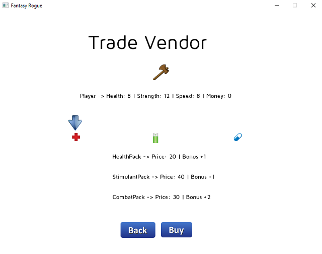

# Game Engine Design Coursework - OpenGL

An OpenGL application written in **C++** which is based on **design patterns** and **object oriented principles**. Game entities are following the **data driven design** which can be configured from an **XML** file.

## Introduction

This prototype includes different menu screens and only very basic game mechanics. It also supports saving a game in progress and the use of the mouse to choose options.

### Menu Screens

  -	When run, the game firstly displays a ‘splash’ screen with the developer and company name.

  - **Main Menu** has the following options:
    -	New Game (N)
    - Continue Game (C) – After returning to the main menu from a game in play, this option is visible.
    - Load Game (L) – This option should be visible when a save game exists.
    - Quit (Q / Esc)
    - Credits (R)
    
  -	Selecting **New Game** takes the player to a Character Select screen. Press return (or click on a continue button) to continue to the main game screen. Starting a new game resets all player/monsters.
  
  -	**Continue Game** is visible after returning to the main menu from a game in play. This option is available if the player is killed or after they have won the game.
  
  -	**Load Game** loads the current saved game and then takes the player straight to the **Main Game screen**.
  
  -	**Quit** exits the game. If there is a game in progress, a check if the player wishes to save the game is displayed. 
  
  -	**Credits** should display a screen of game credits. After 30 seconds, or any key being pressed, this should return to the main menu.
  
  -	A **Game Over screen** is displayed when the player kills the final monster or is killed. Pressing return takes the player back to the main menu. 

### Game Screens

The game has two screens where the action plays: a 2D map screen, with the player and all monsters/items displayed and a combat screen which displays the player and a single monster only.

-	**Map Screen** shows the player and all monsters/items. Score and player stats are displayed along the bottom of the screen. The player can move their marker using WASD or arrow keys. If at any time the player comes into contact with a monster, the game changes into the **Combat screen**. Items can be picked up on contact, with appropriate effects taking place immediately. Pressing **Escape**  pauses the game and takes the player to the **Main Menu**.

-	**Combat screen** contains the player marker shown on the left and the monster marker on the right. Score and player stats are shown below the player, monster stats (including name) are shown below the monster. Combat is resolved in a single steps as follow: **return key** which will add a text to indicate the outcome of the combat and pressing **space key** will simultate an attack on the monster.

### Player and Monster Stats

The player stats are: 

- **Health** (initial value: 10)
- **Strength** (initial value: 10)
- **Speed** (initial value: 10)
- **Dollars** (initial value: 0)

The monster characters are:

Monster | Health | Strength | Speed | Dollars | Item Drop
--- | --- | --- | --- | --- | ---
Raider | 12 | 7 | 12 | 100$ | 40%
Brute | 12 | 8 | 6 | 10$ | 15%
Fodder | 3 | 3 | 7 | 1$ | 5%

The game starts with one raider, three brutes and five fodder. Monsters are placed randomly initially, or by positions read in from a save game file.

### Combat Resolution

1. Basic Combat Resolution

  - The character with the higher speed will inflict the first hit (random pick if speeds are equal): deduct their strength from the current health of their opponent. If the opponent is still alive, then the opponent hits back. This continues until one character reaches zero health or below - the character with health remaining is the winner.

2. Random Damage

  - The random damage rule allows each character to inflict a random amount of damage in each hit. The amount of damage is a random value between 2 and the character's strength.
  
3. Healing After Combat

  - Immediately after a combat, the player heals half of the damage taken during that combat.
   
4. Combat Drops

  - Upon winning a combat, a monster will drop an amount of money indicated in the table above. Each monster also has a small chance of dropping an item.

### Items

The following items can be picked up:

1. **Health Pack** heals all damage. If the player is at full health already, increase max health by 1.
2. **Combat Pack** increase strength by 2.
3. **Stimulant** increases speed by 1.

One stimulant, two combat packs and two health packs are present on the initial map, at random location.

Additionally, each monster has a small chance of dropping an item when defeated in combat. When an item is dropped, the type is determined according to the following table:

Item | Drop-Rate
--- | ---
Health Pack | 60% chance
Combat Pack | 20% chance
Stimulant |	20% chance

## Requirements

- Visual Studio 2013
- OpenGL Driver v1.1
- VC++ compiler

## Installation

Open the **.sln** file fo the project and compile the **Fantasy Rogue project**. This action will first build the **Zeno library** which acts as a dependency for the main project.

## Screenshots

[YouTube Video](https://www.youtube.com/watch?v=HVz_eqnoEmg)

Screenshot 1

Screenshot 2

Screenshot 3

